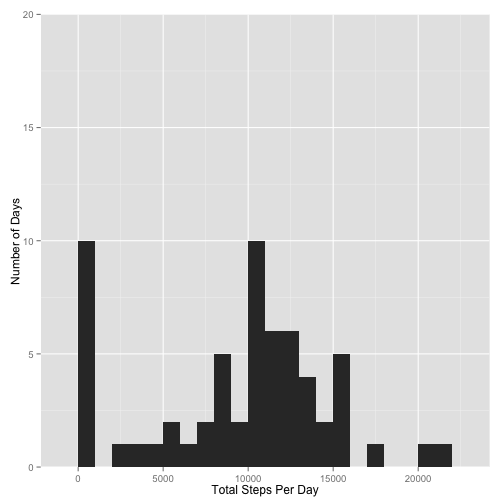
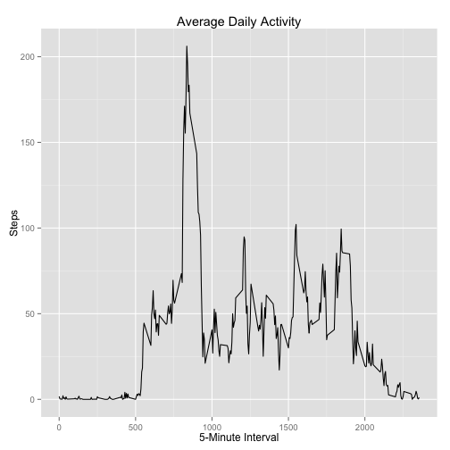
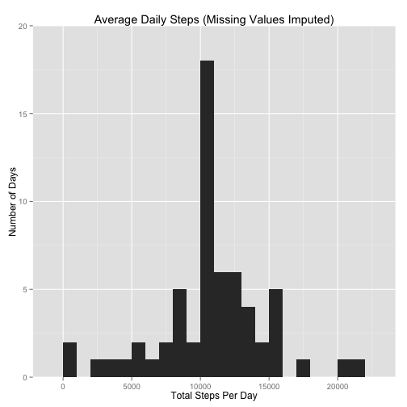
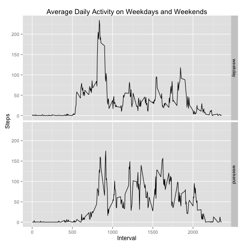
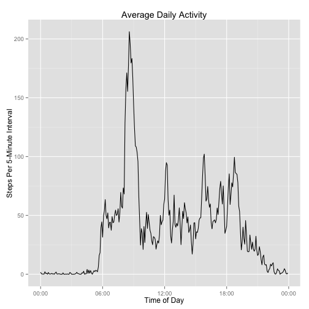
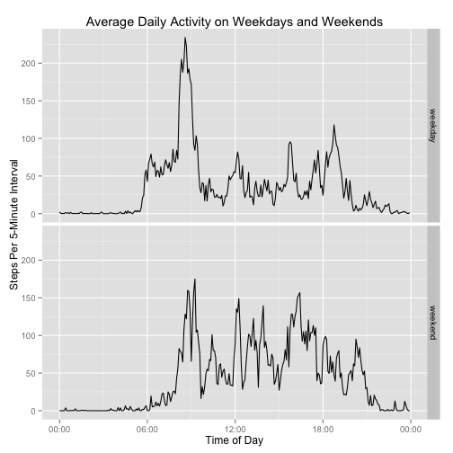

## Loading and preprocessing the data

I carried out the analysis for this project using
R version 3.1.1 (2014-07-10); I used the
[dplyr](http://cran.r-project.org/web/packages/dplyr) package for data
analysis and the
[ggplot2](http://cran.r-project.org/web/packages/ggplot2) package for
plotting. I also used the `md5sum` function in the tools package in
core R, and the `date_format` function in the
[scales](http://cran.r-project.org/web/packages/scales) package. For
complete information on the R environment I used please see Appendix
2 below.

I first loaded the necessary libraries; note that the dplyr package
masks some functions from other packages, so I suppressed any warnings
resulting from such conflicts.


```r
library("dplyr", warn.conflicts = FALSE)
library("ggplot2")
library("tools")
library("scales")
```

The raw data for this project was included in Roger Peng's original
repository in the form of a file `activity.zip`. In order to ensure
that I was working with the correct data, I first computed the MD5
hash of this file and compared it to the known value I previously
computed against the file as cloned from the original GitHub
repository.


```r
stopifnot(md5sum("activity.zip") == "61e0c1f8c4a736ff1ab0f8863344b301")
```

I then extracted the CSV file `activity.csv` and read the data into a
data frame:


```r
unzip("activity.zip")
activity <- read.csv("activity.csv", stringsAsFactors = FALSE)
str(activity)
```

```
## 'data.frame':	17568 obs. of  3 variables:
##  $ steps   : int  NA NA NA NA NA NA NA NA NA NA ...
##  $ date    : chr  "2012-10-01" "2012-10-01" "2012-10-01" "2012-10-01" ...
##  $ interval: int  0 5 10 15 20 25 30 35 40 45 ...
```

As displayed by the `str` function, the `activity` data frame contains
17568 observations of three variables:

* `date`: The date of each observation, in the form "YYYY-MM-DD".
* `interval`: The 5-minute interval during the day during which the
  number of steps was recorded, expressed as 100 * H + M, where H
  is the hour from 0 to 23, and M is the starting minute of the
  interval within the hour, from 0 to 55.
* `steps`: The number of steps recorded during the given interval
  (missing for some observations and recorded as NA).

## What is the mean total number of steps taken per day?

In order to present a histogram of the data I first calculated the total
number of steps for each day, ignoring missing values:


```r
dailySteps <- activity %>%
        group_by(date) %>%
        summarise(steps = sum(steps, na.rm = TRUE))
str(dailySteps)
```

```
## Classes 'tbl_df', 'tbl' and 'data.frame':	61 obs. of  2 variables:
##  $ date : chr  "2012-10-01" "2012-10-02" "2012-10-03" "2012-10-04" ...
##  $ steps: int  0 126 11352 12116 13294 15420 11015 0 12811 9900 ...
##  - attr(*, "drop")= logi TRUE
```

I then plotted a histogram to show how many days the subject walked a
certain number of steps:


```r
p <- ggplot(dailySteps, aes(x = steps))
p <- p + geom_histogram(stat = "bin", binwidth = 1000)
p <- p + coord_cartesian(ylim=c(0, 20))
p <- p + xlab("Total Steps Per Day")
p <- p + ylab("Number of Days")
print(p)
```

 

Note that several days recorded zero steps; this could be either because
the subject didn't walk at all that day, or because no values were recorded
for that day. (Since I ignored missing values in computing the sum above,
a day for which all intervals had values of NA would result in a sum of
zero steps.)

I then calculated the mean and median; note that using
`na.rm = TRUE` was really not necessary since based on the above
computation `dailySteps$steps` would always have a value (which
might be zero if all `steps` values for a day were missing):


```r
mean(dailySteps$steps, na.rm = TRUE)
```

```
## [1] 9354.23
```

```r
median(dailySteps$steps, na.rm = TRUE)
```

```
## [1] 10395
```

Note that although the histogram's peak was around 10,000 steps per day
the mean was brought down because of the large number of days with
zero steps. (The median is less sensitive to this effect.)

## What is the average daily activity pattern?

Each day's observations reflect the subject's activity during that
day. To get a sense for what an average day looks like, I grouped the
observations for each 5-minute interval and took the average number of
steps for that interval across all days (ignoring any missing values).


```r
avgActivity <- activity %>%
        group_by(interval) %>%
        summarise(steps = mean(steps, na.rm = TRUE))
str(avgActivity)
```

```
## Classes 'tbl_df', 'tbl' and 'data.frame':	288 obs. of  2 variables:
##  $ interval: int  0 5 10 15 20 25 30 35 40 45 ...
##  $ steps   : num  1.717 0.3396 0.1321 0.1509 0.0755 ...
##  - attr(*, "drop")= logi TRUE
```

I then plotted the average number of steps for each interval:


```r
p <- ggplot(avgActivity, aes(x = interval, y = steps))
p <- p + geom_line()
p <- p + xlab("5-Minute Interval")
p <- p + ylab("Steps Per Interval")
p <- p + ggtitle("Average Daily Activity")
print(p)
```

 

From the above graph the interval with the most number of steps on
average appeared to be somewhere between 800 and 900. I used the `top_n`
function of the dplyr package to determine the exact interval with the
highest average number of steps:


```r
top_n(avgActivity, 1, steps)
```

```
## Source: local data frame [1 x 2]
## 
##   interval    steps
## 1      835 206.1698
```

Although it was not required for the project, I decided to do a second
plot for this step in order to make the graph more understandable, as
well as more correct. (In particular, the interval values in the above
graph are not evenly spread out on the x axis; for example, for the
first hour of the day they go 45, 50, 55, and then jump straight to
100.) See Appendix 1 for this alternative plot.

## Imputing missing values

Out of the 17568 rows in the `activity` data frame, I
calculated the number of missing values (rows with an NA value for
`steps`) as follows:


```r
sum(is.na(activity$steps))
```

```
## [1] 2304
```

Although it's not required for the project, note also that I found
the number of days for which all values were missing, by counting
the number of observations for each day that had a valid value for
`steps` and then counting the number of days with zero valid
observations:


```r
missingDays <- activity %>%
        group_by(date) %>%
        summarise(validObs = sum(!is.na(steps))) %>%
        filter(validObs == 0) %>%
        nrow()
missingDays
```

```
## [1] 8
```

In cases where a value was missing for a particular interval I chose to
impute the missing value using the average number of steps for that
interval across all days.

In particular I used the `mutate` function of the dplyr package to
change the values of the `steps` variable for all observations in the
`activity` data frame. If the existing value of the `steps` variable
was NA then I set the new value to be the mean of all values of
`steps` for that interval (since I grouped based on the `interval`
variable); otherwise I set the new value to be the same as the
original value.


```r
imputed <- activity %>%
        group_by(interval) %>%
        mutate(steps = ifelse(is.na(steps), mean(steps, na.rm = TRUE), steps))
```

I then recalculated the average number of steps for each interval
using the `imputed` data instead of the original `activity` data;
otherwise the calculation is exactly the same:


```r
dailyImputed <- imputed %>%
        group_by(date) %>%
        summarise(steps = sum(steps, na.rm = TRUE))
```

and replotted the corresponding histogram:


```r
p <- ggplot(dailyImputed, aes(x = steps))
p <- p + geom_histogram(stat = "bin", binwidth = 1000)
p <- p + coord_cartesian(ylim=c(0, 20))
p <- p + xlab("Total Steps Per Day")
p <- p + ylab("Number of Days")
p <- p + ggtitle("Average Daily Steps (Missing Values Imputed)")
print(p)
```

 

I then calculated the mean and median of the new data:


```r
mean(dailyImputed$steps, na.rm = TRUE)
```

```
## [1] 10766.19
```

```r
median(dailyImputed$steps, na.rm = TRUE)
```

```
## [1] 10766.19
```

Note that this mean was higher, since I had imputed values for
the 8 days with no valid observations, which previously contributed
zero values to the mean. Note also that this
median was the same as the mean. That's because the values for the
missing days had been replaced with values corresponding to an
average day, and thus those days had a correspondingly average total
number of steps. When sorting the days according to the total number
of steps the days with all imputed values would have been be in the middle of
the list, and thus the value they had for the total number of steps
per day was chosen as the median number of steps per day.

## Are there differences in activity patterns between weekdays and weekends?

To analyze the differences between activity patterns on weekdays
versus weekends I first tagged all observations according to whether
they were recorded on weekdays or on weekends. (Note that this
required first converting the `date` variable to have POSIX date
values.)


```r
weekendDays <- c("Saturday", "Sunday")
activity <- activity %>%
        mutate(date = as.POSIXct(date, tz = "GMT")) %>%
        mutate(period = as.factor(ifelse(weekdays(date) %in% weekendDays,
                                         "weekend", "weekday")))
str(activity)
```

```
## 'data.frame':	17568 obs. of  4 variables:
##  $ steps   : int  NA NA NA NA NA NA NA NA NA NA ...
##  $ date    : POSIXct, format: "2012-10-01" "2012-10-01" ...
##  $ interval: int  0 5 10 15 20 25 30 35 40 45 ...
##  $ period  : Factor w/ 2 levels "weekday","weekend": 1 1 1 1 1 1 1 1 1 1 ...
```

I then computed the average activity for weekend days and for
weekdays. This was similar to how I previously computed the average
activity for all days, except that I grouped the data by both `period`
and `interval` in order to create separate sets of interval means for
weekdays versus weekends.


```r
avgActivityByPeriod <- activity %>%
        group_by(period, interval) %>%
        summarise(steps = mean(steps, na.rm = TRUE))
glimpse(avgActivityByPeriod)
```

```
## Variables:
## $ period   (fctr) weekday, weekday, weekday, weekday, weekday, weekday...
## $ interval (int) 0, 5, 10, 15, 20, 25, 30, 35, 40, 45, 50, 55, 100, 10...
## $ steps    (dbl) 2.3333333, 0.4615385, 0.1794872, 0.2051282, 0.1025641...
```

I then plotted the data in a panel plot containing graphs for both the
weekday and weekend data:


```r
p <- ggplot(avgActivityByPeriod,
            aes(x = interval, y = steps))
p <- p + facet_grid(period ~ .)
p <- p + geom_line()
p <- p + xlab("Interval")
p <- p + ylab("Steps")
p <- p + ggtitle("Average Daily Activity on Weekdays and Weekends")
print(p)
```

 

Although it was not required for the project, I again converted the
interval values into times of the day for a more readable and accurate
plot; see Appendix 1.

## Appendix 1

As noted above, I wanted to do alternative plots for average daily
activity that were more understandable and accurate. To do these
alternative plots I used the interval values to compute actual times
in POSIX format. This required first converting the interval values to
seconds since midnight, and then converting the seconds values to
POSIX times on an arbitrarily-chosen date. (This date is independent
of the dates of the observations, and is ignored for purposes of
plotting; it's there only because a POSIX time has to include a date
component.)

The first computation is for average daily activity for all days
combined:


```r
avgActivity <- avgActivity %>%
        mutate(time = 3600 * interval %/% 100 + 60 * interval %% 100) %>%
        mutate(time = as.POSIXct(time, origin = "1960-01-01", tz = "GMT"))
str(avgActivity)
```

```
## Classes 'tbl_df', 'tbl' and 'data.frame':	288 obs. of  3 variables:
##  $ interval: int  0 5 10 15 20 25 30 35 40 45 ...
##  $ steps   : num  1.717 0.3396 0.1321 0.1509 0.0755 ...
##  $ time    : POSIXct, format: "1960-01-01 00:00:00" "1960-01-01 00:05:00" ...
```

As a result the x axis of the plot shows the actual times of day for each
interval in terms of hours and minutes:


```r
p <- ggplot(avgActivity, aes(x = time, y = steps))
p <- p + geom_line()
p <- p + scale_x_datetime(labels = date_format(format = "%H:%M"))
p <- p + xlab("Time of Day")
p <- p + ylab("Steps Per 5-Minute Interval")
p <- p + ggtitle("Average Daily Activity")
print(p)
```

 

Note that on a typical day the subject's activity rapidly increases
when they wake up around 6 am, reaches a peak around 8:30 am, and
then fluctuates through the remainder of the morning and afternoon
before declining past 9 pm as bedtime approaches.

The second plot is for average daily activity on weekdays
vs. weekends. Again I converted the intervals to times of day:


```r
avgActivityByPeriod <- avgActivityByPeriod %>%
        mutate(time = 3600 * interval %/% 100 + 60 * interval %% 100) %>%
        mutate(time = as.POSIXct(time, origin = "1960-01-01", tz = "GMT"))
glimpse(avgActivityByPeriod)
```

```
## Variables:
## $ period   (fctr) weekday, weekday, weekday, weekday, weekday, weekday...
## $ interval (int) 0, 5, 10, 15, 20, 25, 30, 35, 40, 45, 50, 55, 100, 10...
## $ steps    (dbl) 2.3333333, 0.4615385, 0.1794872, 0.2051282, 0.1025641...
## $ time     (time) 1960-01-01 00:00:00, 1960-01-01 00:05:00, 1960-01-01...
```

and then plotted the data with an appropriate x axis:


```r
p <- ggplot(avgActivityByPeriod,
            aes(x = time, y = steps))
p <- p + facet_grid(period ~ .)
p <- p + geom_line()
p <- p + scale_x_datetime(labels = date_format(format = "%H:%M"))
p <- p + xlab("Time of Day")
p <- p + ylab("Steps Per 5-Minute Interval")
p <- p + ggtitle("Average Daily Activity on Weekdays and Weekends")
print(p)
```

 

Note that on weekends the subject's activity doesn't increase
significantly until after 8 am (versus about 6 am on weekdays),
presumably because they wake up later than on weekdays. During the day
the subject is more active on weekends than on weekdays. Finally, on
weekends the subject's activity peaks later in the evening, presumably
reflecting a later bedtime.

## Appendix 2

I used the following R environment in doing the analysis for this
project:


```r
sessionInfo()
```

```
## R version 3.1.1 (2014-07-10)
## Platform: x86_64-apple-darwin13.1.0 (64-bit)
## 
## locale:
## [1] en_US.UTF-8/en_US.UTF-8/en_US.UTF-8/C/en_US.UTF-8/en_US.UTF-8
## 
## attached base packages:
## [1] tools     stats     graphics  grDevices utils     datasets  methods  
## [8] base     
## 
## other attached packages:
## [1] scales_0.2.4  ggplot2_1.0.0 dplyr_0.3.0.2 knitr_1.7    
## 
## loaded via a namespace (and not attached):
##  [1] assertthat_0.1   colorspace_1.2-4 DBI_0.3.1        digest_0.6.4    
##  [5] evaluate_0.5.5   formatR_1.0      grid_3.1.1       gtable_0.1.2    
##  [9] labeling_0.3     lazyeval_0.1.9   magrittr_1.0.1   MASS_7.3-35     
## [13] munsell_0.4.2    parallel_3.1.1   plyr_1.8.1       proto_0.3-10    
## [17] Rcpp_0.11.3      reshape2_1.4     stringr_0.6.2
```
